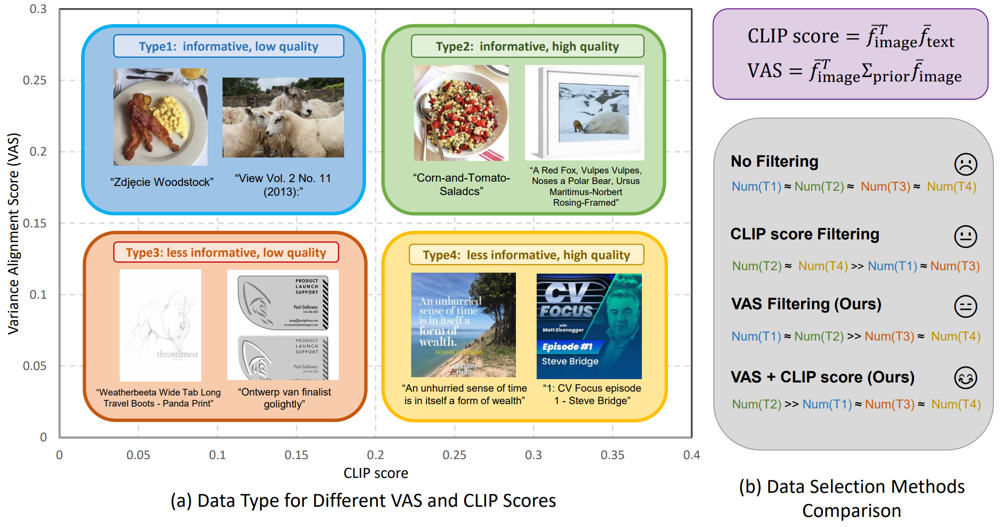

# Variance Alignment Score: A Simple But Tough-to-Beat Data Selection Method for Multimodal Contrastive Learning
[[ Paper ]](https://arxiv.org/abs/2402.02055)

This is an official code of Variance Alignment score (VAS), which is a simple but efficient data selection method for CLIP model. 

If you found this repository, our paper or data useful, please consider citing:

```
@article{wang2024variance,
  title={Variance Alignment Score: A Simple But Tough-to-Beat Data Selection Method for Multimodal Contrastive Learning},
  author={Wang, Yiping and Chen, Yifang and Yan, Wendan and Jamieson, Kevin and Du, Simon Shaolei},
  journal={arXiv preprint arXiv:2402.02055},
  year={2024}
}

```

## Overview

Recently, data selection has emerged as a core issue for large-scale visual-language model pretraining like training CLIP, especially on noisy web-curated datasets. In this scenario, we design a simple but efficient data selection method named Variance Alignment score (VAS) filtering. It utilizes a very simple formula to evaluate the informativeness of data, which is an important but neglected factor of quality scores such as CLIP similarities. Details in our [paper](https://arxiv.org/abs/2402.02055).

<p align="center">

</p>


## Installing Dependencies and Downloading Dataset
Please follow [DataComp](https://github.com/mlfoundations/datacomp/) to install the dependencies and DataComp dataset. Our code supports DataComp-Small (12.8M data in total, need 528G space) and DataComp-Medium (128M data in total, need 5.28T space) now. 

## Run VAS/VAS-D
We can run VAS/VAS-D + CLIP score filtering by execuating `run_datacomp_small.sh` for DataComp-Small dataset and  `run_datacomp_medium.sh` for DataComp-Medium dataset. Here in these files, we recommend the path to DataComp-x dataset as `path/to/datasets/datacomp_x/`, and the path to files as `path/to/files/datacomp_x/`. Our code is also compatible to [DataComp](https://github.com/mlfoundations/datacomp/) and support running their baselines.

## Run experiments
After running filtering algorithm, we can run `run_exp.sh` to realize 1. resharding training dataset, 2. training model, 3. evaluating on 38 downstream tasks. Please first specific the `scale`, `datacomp_scale` and `filter_list` in `run_exp.sh` as the examples given.


## Checkpoints and UIDs

Will be released soon.


## Acknowlegements
We thank the authors of DataComp for open sourcing their codes.